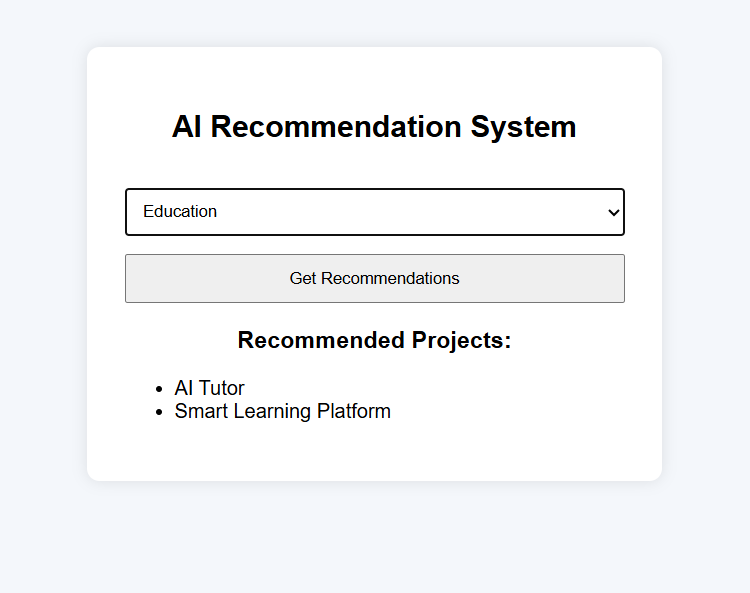

# AI Recommendation System



An AI-based recommendation system that suggests relevant project ideas based on user interests.

## Features
- Interest-based recommendations
- Simple AI decision logic
- Clean web interface
- Fast and lightweight

## Tech Stack
Python, Flask, HTML, CSS

## How It Works
User selects an interest → system recommends suitable AI projects.

## Run Locally
```bash
pip install -r requirements.txt
python app.py

